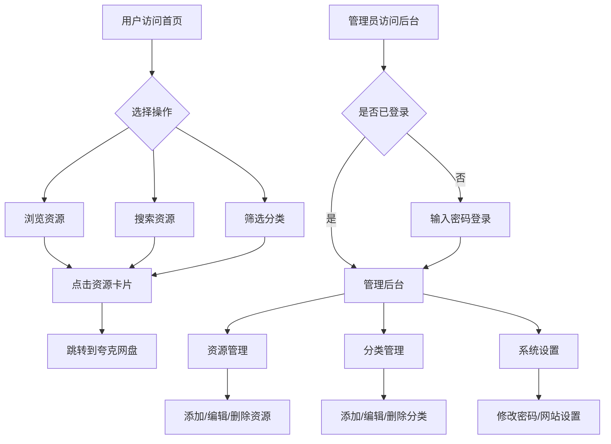

# 夸克网盘资源分享网站 - 技术方案

## 📋 项目概述

一个简单轻量的夸克网盘资源链接分享网站，支持资源分类、搜索，以及后台管理功能。

## 🛠️ 技术栈选择

| 组件 | 技术选择 | 理由 |
|------|---------|------|
| **后端** | Python Flask | 简单轻量，跨平台，易于部署 |
| **前端** | HTML + TailwindCSS + Alpine.js | 通过 CDN 引入，无需构建步骤，开发简单 |
| **数据存储** | JSON 文件 | 无需数据库，简单易维护 |
| **UI 框架** | TailwindCSS | 现代美观，响应式设计 |
| **交互** | Alpine.js | 轻量级 JS 框架，仅 15KB |

## 📁 项目结构

```
quark-share/
├── app.py                  # Flask 主应用
├── config.json             # 网站配置（密码、标题等）
├── requirements.txt        # Python 依赖
├── README.md               # 使用说明
│
├── data/
│   └── resources.json      # 资源数据存储
│
├── templates/
│   ├── base.html           # 基础模板
│   ├── index.html          # 前台首页
│   ├── admin/
│   │   ├── login.html      # 管理员登录页
│   │   ├── dashboard.html  # 管理后台主页
│   │   ├── resources.html  # 资源管理
│   │   └── settings.html   # 设置页面
│   └── components/
│       ├── navbar.html     # 导航栏组件
│       ├── card.html       # 资源卡片组件
│       └── footer.html     # 页脚组件
│
└── static/
    ├── css/
    │   └── custom.css      # 自定义样式
    └── images/
        └── logo.png        # 网站 Logo（可选）
```

## 💾 数据结构设计

### config.json（配置文件）
```json
{
  "site_title": "夸克资源站",
  "site_description": "精选优质资源分享",
  "admin_password": "admin123",
  "items_per_page": 12
}
```

### data/resources.json（资源数据）
```json
{
  "categories": [
    { "id": "games", "name": "游戏", "icon": "🎮" },
    { "id": "software", "name": "软件", "icon": "💻" },
    { "id": "movies", "name": "影视", "icon": "🎬" },
    { "id": "music", "name": "音乐", "icon": "🎵" },
    { "id": "ebooks", "name": "电子书", "icon": "📚" },
    { "id": "other", "name": "其他", "icon": "📦" }
  ],
  "resources": [
    {
      "id": "res_001",
      "title": "资源名称",
      "description": "资源描述信息",
      "category": "games",
      "link": "https://pan.quark.cn/s/xxxxxxxxxx",
      "size": "10GB",
      "tags": ["热门", "推荐"],
      "clicks": 0,
      "created_at": "2024-01-01T12:00:00",
      "updated_at": "2024-01-01T12:00:00"
    }
  ]
}
```

> **💡 分类完全自定义**：上面的分类只是默认示例，您可以在管理后台自由添加、编辑、删除分类，每个分类可以设置名称和图标（Emoji）。

## 🎨 页面设计

### 1. 前台首页 (index.html)
```
┌─────────────────────────────────────────────────────────────┐
│  🌟 夸克资源站                              [搜索框]        │
├─────────────────────────────────────────────────────────────┤
│  分类：[全部] [🎮游戏] [💻软件] [🎬影视]   排序：[最新▼]    │
├─────────────────────────────────────────────────────────────┤
│                                                             │
│  ┌─────────┐  ┌─────────┐  ┌─────────┐  ┌─────────┐       │
│  │  🎮     │  │  💻     │  │  🎬     │  │  🎮     │       │
│  │ 资源1   │  │ 资源2   │  │ 资源3   │  │ 资源4   │       │
│  │ 描述... │  │ 描述... │  │ 描述... │  │ 描述... │       │
│  │ [保存]  │  │ [保存]  │  │ [保存]  │  │ [保存]  │       │
│  └─────────┘  └─────────┘  └─────────┘  └─────────┘       │
│                                                             │
│  ┌─────────┐  ┌─────────┐  ┌─────────┐  ┌─────────┐       │
│  │  ...    │  │  ...    │  │  ...    │  │  ...    │       │
│  └─────────┘  └─────────┘  └─────────┘  └─────────┘       │
│                                                             │
│                    [加载更多 / 分页]                        │
├─────────────────────────────────────────────────────────────┤
│  © 2024 夸克资源站                                          │
└─────────────────────────────────────────────────────────────┘
```

### 2. 管理后台
```
┌─────────────────────────────────────────────────────────────┐
│  🔧 管理后台                              [返回前台] [退出]  │
├───────────┬─────────────────────────────────────────────────┤
│           │                                                 │
│  📊 概览  │    资源管理                                     │
│           │    ─────────────────────────────────────────    │
│  📦 资源  │    [+ 添加资源]                                 │
│           │                                                 │
│  🏷️ 分类  │    ┌────┬────────┬──────┬──────┬────────┐     │
│           │    │选择│ 标题   │ 分类 │ 大小 │ 操作   │     │
│  ⚙️ 设置  │    ├────┼────────┼──────┼──────┼────────┤     │
│           │    │ □  │资源1   │ 游戏 │ 10GB │ 编辑删除│    │
│           │    │ □  │资源2   │ 软件 │ 2GB  │ 编辑删除│    │
│           │    │ □  │资源3   │ 影视 │ 5GB  │ 编辑删除│    │
│           │    └────┴────────┴──────┴──────┴────────┘     │
│           │                                                 │
│           │    [批量删除]                [上一页] [下一页]  │
│           │                                                 │
└───────────┴─────────────────────────────────────────────────┘
```

## 🔌 API 接口设计

### 前台接口

| 方法 | 路径 | 说明 |
|------|------|------|
| GET | `/` | 首页 |
| GET | `/api/resources` | 获取资源列表（支持分页、分类筛选、搜索、排序） |
| GET | `/api/categories` | 获取分类列表 |
| POST | `/api/resources/<id>/click` | 记录资源点击（统计点击量） |

#### `/api/resources` 查询参数

| 参数 | 类型 | 说明 |
|------|------|------|
| `page` | int | 页码，默认 1 |
| `limit` | int | 每页数量，默认 12 |
| `category` | string | 分类ID筛选 |
| `search` | string | 搜索关键词（标题/描述） |
| `sort` | string | 排序方式：`newest`（最新）、`oldest`（最早）、`popular`（最热门）、`name`（按名称） |

### 管理接口（需要密码验证）

| 方法 | 路径 | 说明 |
|------|------|------|
| POST | `/admin/login` | 管理员登录验证 |
| GET | `/admin/logout` | 退出登录 |
| GET | `/admin` | 管理后台首页 |
| POST | `/api/admin/resources` | 添加资源 |
| PUT | `/api/admin/resources/<id>` | 更新资源 |
| DELETE | `/api/admin/resources/<id>` | 删除资源 |
| POST | `/api/admin/categories` | 添加分类 |
| PUT | `/api/admin/categories/<id>` | 更新分类 |
| DELETE | `/api/admin/categories/<id>` | 删除分类 |
| PUT | `/api/admin/password` | 修改密码 |
| PUT | `/api/admin/settings` | 更新网站设置 |

## 🔒 安全设计

1. **Session 管理**：使用 Flask-Session 管理登录状态
2. **密码存储**：配置文件中存储（简单方案），密码通过后台可修改
3. **CSRF 保护**：使用 Flask-WTF 提供的 CSRF 保护
4. **输入验证**：对所有用户输入进行验证和清理

## 📦 依赖清单

```txt
# requirements.txt
Flask==3.0.0
Flask-Session==0.5.0
```

## 🚀 部署方案

### Windows 本地测试
```bash
# 1. 安装 Python 3.8+
# 2. 创建虚拟环境
python -m venv venv
venv\Scripts\activate

# 3. 安装依赖
pip install -r requirements.txt

# 4. 运行应用
python app.py

# 5. 访问 http://localhost:5000
```

### Ubuntu 服务器部署
```bash
# 1. 安装 Python 和 pip
sudo apt update
sudo apt install python3 python3-pip python3-venv

# 2. 克隆/上传项目
cd /var/www
git clone <repo> quark-share  # 或者直接上传文件

# 3. 创建虚拟环境
cd quark-share
python3 -m venv venv
source venv/bin/activate

# 4. 安装依赖
pip install -r requirements.txt
pip install gunicorn  # 生产环境 WSGI 服务器

# 5. 使用 Gunicorn 运行
gunicorn -w 2 -b 0.0.0.0:5000 app:app

# 6. 可选：配置 Nginx 反向代理 + Systemd 服务
```

## 📊 功能流程图



## ✅ 功能清单

### 前台功能
- [x] 资源列表展示（卡片式布局）
- [x] 分类筛选（自定义分类）
- [x] 关键词搜索
- [x] 分页加载
- [x] 响应式设计（支持手机/平板/电脑）
- [x] 点击跳转夸克网盘
- [x] **点击量统计**（显示每个资源的点击次数）
- [x] **排序功能**（按最新/最热门/最早/名称排序）

### 管理后台
- [x] 密码登录
- [x] 资源增删改查
- [x] **自定义分类管理**（添加/编辑/删除分类，自定义图标）
- [x] 批量删除
- [x] 修改管理密码
- [x] 网站设置（标题、描述等）
- [x] **点击量统计报表**（查看热门资源排行）

## 🎯 UI 设计要点

### 设计风格：磨砂玻璃 + 暗黑主题（Glassmorphism Dark）

#### 配色方案
```css
/* 主色调 */
--bg-primary: #0a0a0f;        /* 深黑背景 */
--bg-secondary: #111827;       /* 次级背景 */
--accent-gradient: linear-gradient(135deg, #667eea 0%, #764ba2 100%); /* 紫蓝渐变 */
--accent-blue: #3b82f6;        /* 强调蓝 */
--accent-purple: #8b5cf6;      /* 强调紫 */

/* 磨砂玻璃效果 */
--glass-bg: rgba(255, 255, 255, 0.05);
--glass-border: rgba(255, 255, 255, 0.1);
--glass-blur: blur(10px);

/* 文字颜色 */
--text-primary: #ffffff;
--text-secondary: rgba(255, 255, 255, 0.7);
--text-muted: rgba(255, 255, 255, 0.5);
```

#### 磨砂玻璃卡片样式
```css
.glass-card {
  background: rgba(255, 255, 255, 0.05);
  backdrop-filter: blur(10px);
  -webkit-backdrop-filter: blur(10px);
  border: 1px solid rgba(255, 255, 255, 0.1);
  border-radius: 16px;
  box-shadow: 0 8px 32px rgba(0, 0, 0, 0.3);
}

.glass-card:hover {
  background: rgba(255, 255, 255, 0.08);
  border-color: rgba(255, 255, 255, 0.2);
  transform: translateY(-4px);
  box-shadow: 0 12px 40px rgba(0, 0, 0, 0.4);
}
```

#### 设计效果预览

```
┌─────────────────────────────────────────────────────────────┐
│ ░░░░░░░░░░░░░░░░░░░░░░░░░░░░░░░░░░░░░░░░░░░░░░░░░░░░░░░░░░ │
│ ░  ╔═══════════════════════════════════════════════════╗  ░ │
│ ░  ║  🌟 夸克资源站          🔍 搜索...                ║  ░ │
│ ░  ╠═══════════════════════════════════════════════════╣  ░ │
│ ░  ║  全部  🎮游戏  💻软件  🎬影视  📚电子书           ║  ░ │
│ ░  ╚═══════════════════════════════════════════════════╝  ░ │
│ ░                                                         ░ │
│ ░  ╭─────────────╮  ╭─────────────╮  ╭─────────────╮     ░ │
│ ░  │▓▓▓▓▓▓▓▓▓▓▓▓▓│  │▓▓▓▓▓▓▓▓▓▓▓▓▓│  │▓▓▓▓▓▓▓▓▓▓▓▓▓│     ░ │
│ ░  │▓  🎮       ▓│  │▓  💻       ▓│  │▓  🎬       ▓│     ░ │
│ ░  │▓ 游戏资源  ▓│  │▓ 软件工具  ▓│  │▓ 热门影视  ▓│     ░ │
│ ░  │▓ 描述...   ▓│  │▓ 描述...   ▓│  │▓ 描述...   ▓│     ░ │
│ ░  │▓  立即保存 ▓│  │▓  立即保存 ▓│  │▓  立即保存 ▓│     ░ │
│ ░  ╰─────────────╯  ╰─────────────╯  ╰─────────────╯     ░ │
│ ░                                                         ░ │
│ ░░░░░░░░░░░░░░░░░░░░░░░░░░░░░░░░░░░░░░░░░░░░░░░░░░░░░░░░░░ │
└─────────────────────────────────────────────────────────────┘

图例：░ = 渐变背景  ▓ = 磨砂玻璃效果  ╭╮╰╯ = 圆角卡片
```

#### 关键设计元素

1. **背景**：深色渐变背景，可选添加动态光效或粒子效果
2. **卡片**：磨砂玻璃效果（半透明 + 模糊 + 细边框）
3. **按钮**：渐变色（紫蓝），悬浮时发光效果
4. **图标**：使用 Emoji 或 SVG 图标增添色彩
5. **动画**：平滑过渡，悬浮上浮效果
6. **响应式**：移动端优先，4列/3列/2列/1列自适应
7. **加载动画**：骨架屏或淡入效果

---

## 📝 下一步行动

确认此方案后，将按以下顺序实现：

1. 创建项目基础结构
2. 实现 Flask 后端 API
3. 创建前台页面（首页）
4. 创建管理后台页面
5. 测试所有功能
6. 编写部署文档